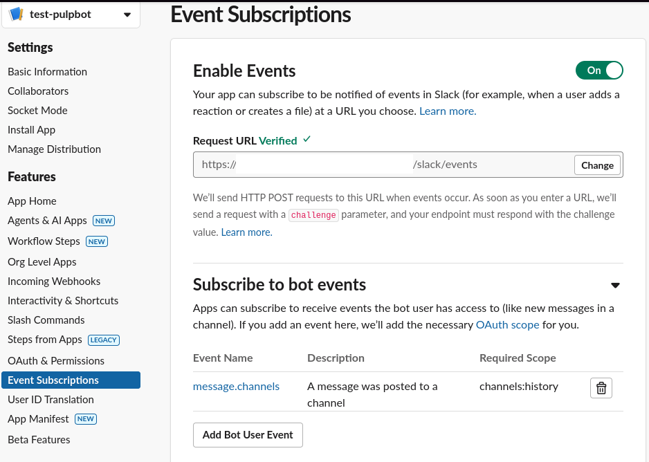

# Install Ollama to run LLM locally
```bash
curl -fsSL https://ollama.com/install.sh | sh
```

# Install pre-reqs to build pip packages
```bash
sudo dnf install rust cargo python-devel gcc-c++
```

# Install python packages
```bash
pip install -r requirements.txt
```

# Pull the model
```bash
ollama pull llama3.2:1b
```

# RUNNING
```bash
python pulpbot.py
```

## make the app/bot accessible from Internet, for example:
```bash
ngrok http 5000
```


# PRE-REQS

1. access/permissions to a slack workspace (we don't have permission to add bots to Red Hat workspace)
2. access to slack channel
3. slack token defined in .env file
4. slack signing secret defined in .env file
5. add slack app/bot to the channel
6. add `channels:history` and `chat:write` permissions to slack app
7. subscribe the bot to be notified of events




